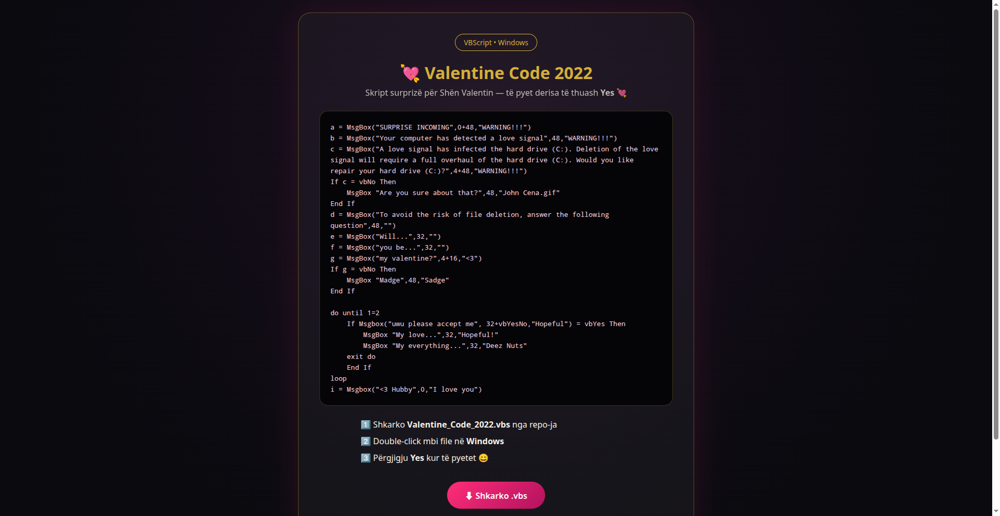

# 💘 Valentine Code 2022

> Skript argëtues surprizë për Shën Valentin — shkruar në VBScript, ekzekutohet në Windows.

**💻 Ky kod ekzekutohet në Windows** (double-click mbi `Valentine_Code_2022.vbs`) — nuk hapet në browser. Faqja demo më poshtë është vetëm prezantim i kodit.

## 💡 Çfarë bën

- Hap një seri dritaresh `MsgBox` me mesazhe surprizë dhe paralajmërime qesharake ("love signal" 😄)
- Të pyet: **"Will you be my valentine?"**
- Nëse zgjedh **No**, të ngacmon derisa të thuash **Yes** (loop-i vazhdon derisa të pranosh 💘)
- **Nuk fshin asnjë file** — të gjitha "paralajmërimet" janë shaka

## ▶️ Ekzekutimi

1. Shkarko `Valentine_Code_2022.vbs`
2. Double-click mbi file në Windows
3. Përgjigju me **Yes** kur të pyetet 😄

> Kërkon Windows me Windows Script Host (aktiv si parazgjedhje).

## 📄 Licenca

Copyright © 2026 Erion Nezha. Të gjitha të drejtat e rezervuara. Shih [LICENSE](LICENSE).

---

# 💘 Valentine Code 2022

> A fun Valentine's surprise script — written in VBScript, runs on Windows.

**💻 This code runs on Windows** (double-click `Valentine_Code_2022.vbs`) — not in the browser. The demo page below is just a code showcase.

## 💡 What it does

- Opens a series of `MsgBox` popups with surprise messages and funny fake warnings ("love signal" 😄)
- Asks you: **"Will you be my valentine?"**
- If you pick **No**, it teases you until you say **Yes** (the loop continues until you accept 💘)
- **Deletes no files** — all "warnings" are jokes

## ▶️ Run it

1. Download `Valentine_Code_2022.vbs`
2. Double-click the file on Windows
3. Answer **Yes** when asked 😄

> Requires Windows with Windows Script Host (enabled by default).

## 📄 License

Copyright © 2026 Erion Nezha. All rights reserved. See [LICENSE](LICENSE).
